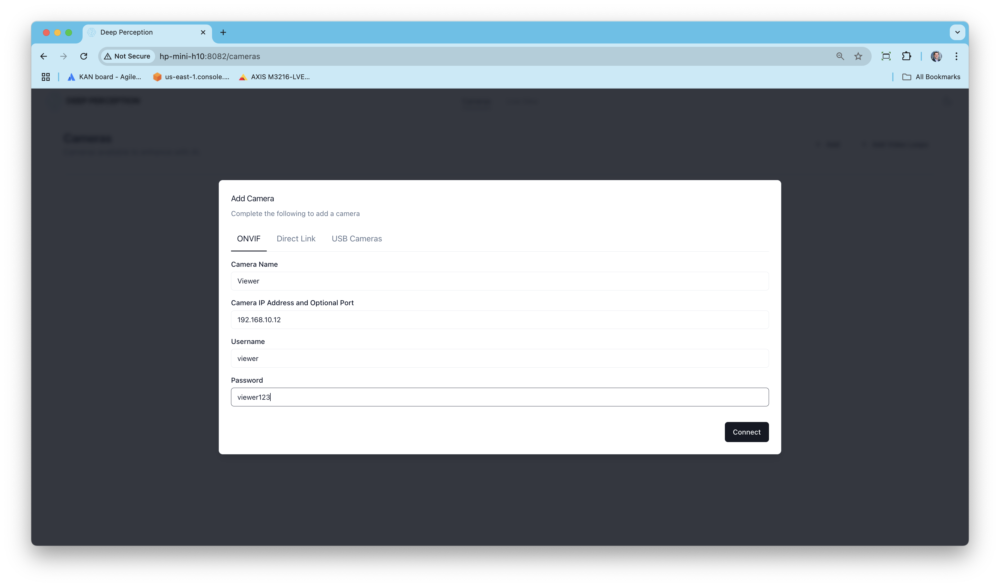
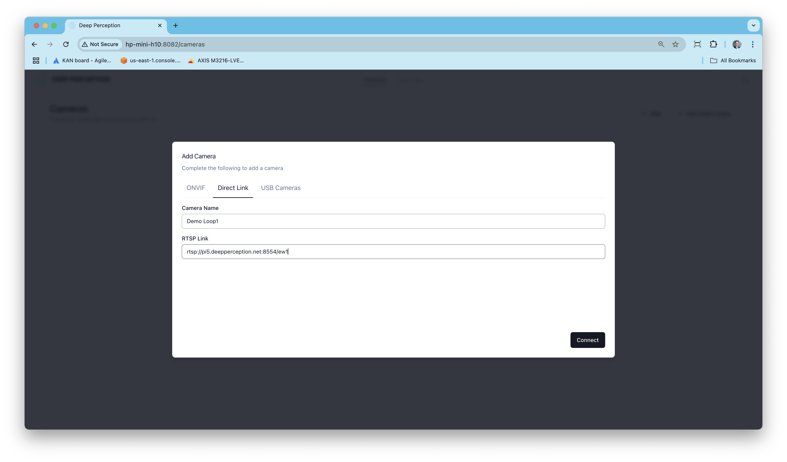
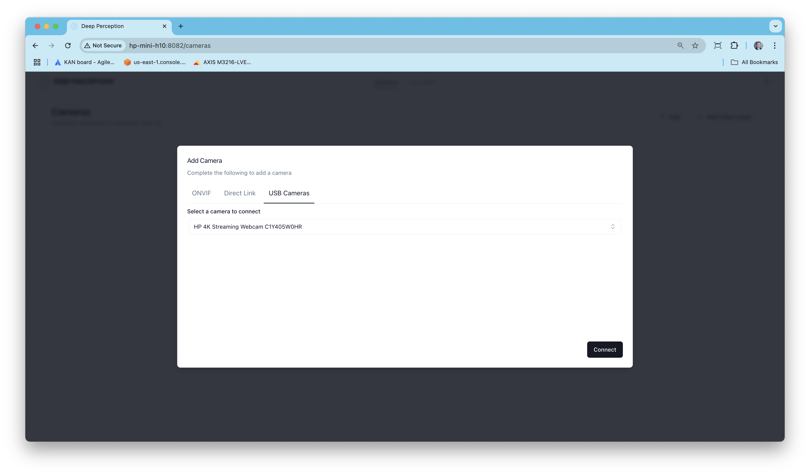

# Setup for Prometheus Software

## Demo and Config Videos: 

Demo Video: https://www.youtube.com/watch?v=WLws3rbnVts

Adding Built in Video Loops: https://www.youtube.com/watch?v=Nx5h7YJvKHI

## System Requirements:

1. Ubuntu 22.04 or 24.04 LTS Desktop. Note Arrow Lake systems need 24.04 LTS.
2. High core count CPU (i5 or better) to run 2 and 4 Hailo configurations. 
3. 1,2 or 4 Hailo-8 or a single Hailo-10H AI accelerators (Our scripts will install the kernel modules version, do not manually install the driver beforehand).
4. **Required to use setup script: Disable Secure Boot** in the BIOS or Hailo kernel module will not load.
5. **A sufficient thermal solution for the Hailo accelerators must be in place or choppy video will occur and/or the Hailo will lock up until the system is rebooted.**  
6. Optional: Video sources consisting of any combination of ONVIF cameras, direct RTSP links and directly attached USB cameras. 1920x1080 sources preferred. Demo loop vidoes are included and may be used as an alternative or in combination with live sources.
7. System that supports VA-API h264 encode and decode (Most Intel and AMD integrated and discrete graphics cards supported) or an NVIDIA GPU.

NVIDIA GPUs may have software restrictions that limit the number of simultaneous NVENC sessions. See for an unsupported https://github.com/keylase/nvidia-patch way to remove these limits. ~2.5G of VRAM is needed for each Hailo chip (4 streams per Hailo chip).

## Initial Setup on clean Ubuntu 22.04 or 24.04 LTS Desktop Installation

1. Clone this repo on to the target machine `git clone https://github.com/Deep-Perception/prometheus-setup.git`
2. Navigate to the setup script folder `cd prometheus-setup/setup`
3. Run `./setup.sh` and reboot when prompted.

For systems with both Intel/AMD and NVIDIA cards, if you want to disable support for nvidia, you can run `./setup --disable-nvidia`. This skips the NVIDIA card detection and VA-API will be used for H264 en/decode purposes. 

Our setup script installs the NVIDIA container runtime but configuring the NVIDIA drivers is outside the scope of our setup script. To validate the NVIDIA container runtime can access the GPU, you can run `docker run --rm --gpus all nvidia/cuda:12.9.0-base-ubuntu22.04 nvidia-smi`.

**If you change the number of Hailo accelerators in the system or switch between Hailo-8 and Hailo-10 accelerators, you must re-run the `setup.sh` script.**

## Running the Software

1. From the `prometheus-setup` directory, `run.sh` to start the demo software
2. From the `prometheus-setup` directory, `stop.sh` to stop the demo software
3. Open Chrome and navigate to http://localhost:8082 if running locally or use the IP address and port 8082 of the remote machine. (F11 can be used to put Chrome into full screen kiosk mode)
4. Add any combination of camera sources or video loops.
- 1 Hailo: 4 Sources
- 2 Hailo: 8 Sources
- 4 Hailo: 16 Sources

The framerate defaults to 10FPS but can be adjusted by setting the SOURCE_FPS variable for the iris_server containers in the docker compose file. 15FPS is the maximum supported. There is one iris_server instance per Hailo device, so if you have 4 Hailo's you must set this variable in 4 places.

**Known Issue 1:** When running 2 or 4 Hailo-10s, you may experience issues where the driver hangs after stopping and restarting the application one or more times. CHECK failed - Failed to de-serialize 'CreateDevice' and CHECK_SUCCESS failed with status=HAILO_RPC_FAILED(77) - Failed to create device will be present in the logs when this happens. To recover, stop application and run `sudo rmmod hailo_pci && sudo modprobe hailo_pci` or reboot your system.

**Known Issue 2:** Intermittently Hailo APIs for utilization metrics will continuously return 0 resulting in the utilization graph being flat at 0%. When this occurs try restarting the application or reboot your system.

### Adding ONVIF Cameras

### Adding RTSP Streams

### Adding USB Cameras

### Adding Built in Video Loops

### Live View

Use the slider to adjust the number of videos and the toggles to turn on/off Hailo accelerators or the person attributes model.

## Maintenance Operations

1. `docker system prune --all` followed by `docker volume prune --all` will completely clear out the software or run the `reset.sh` script.
2. `docker compose pull` will download the latest containers without running them 
